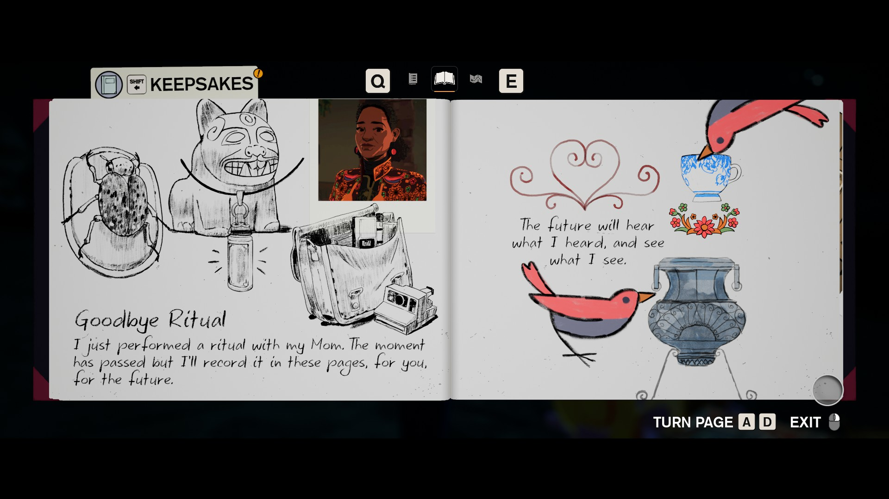
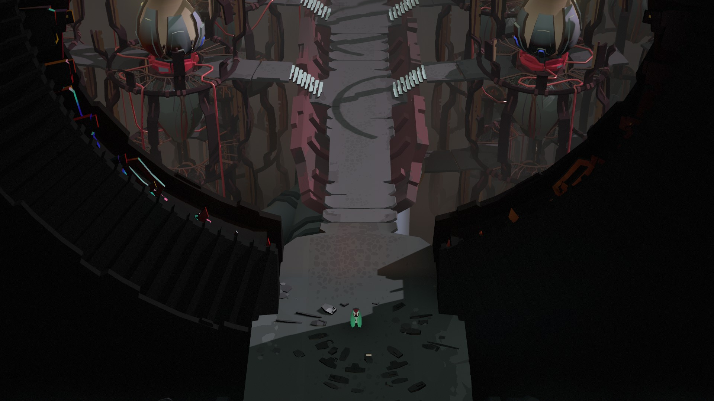
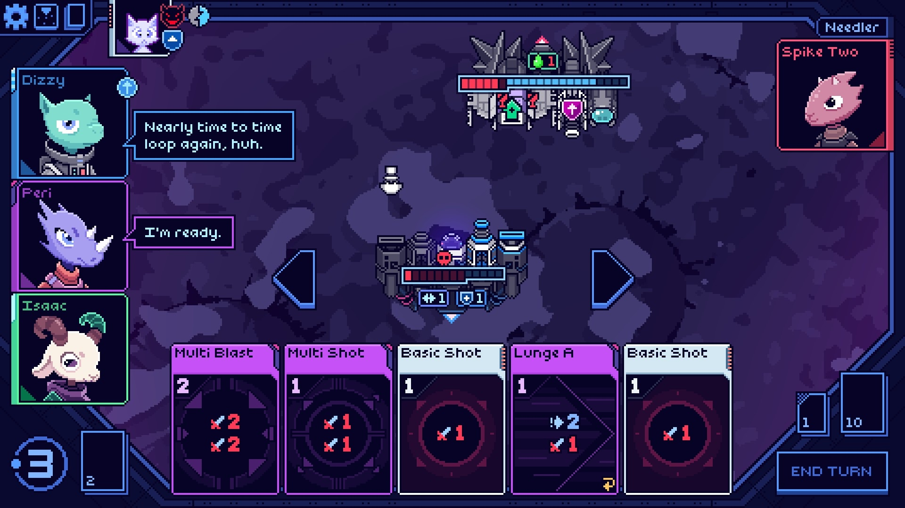
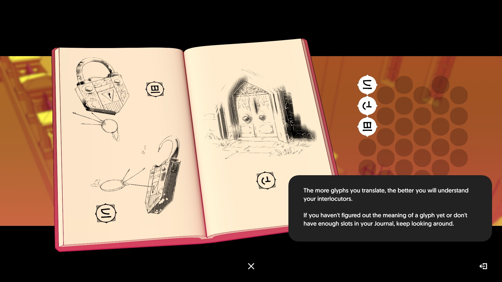
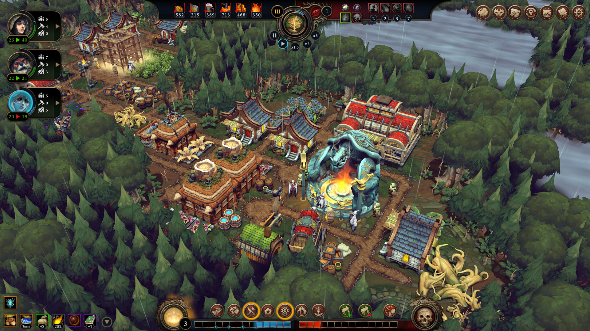
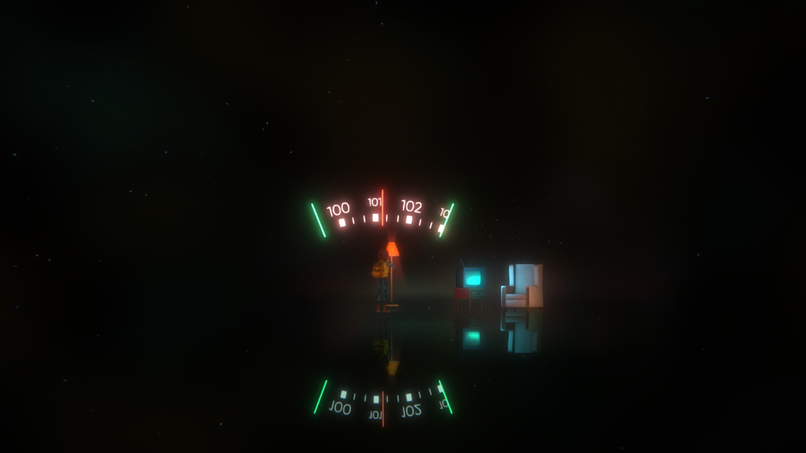
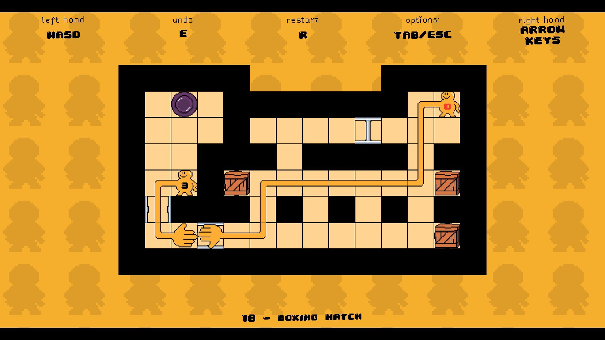
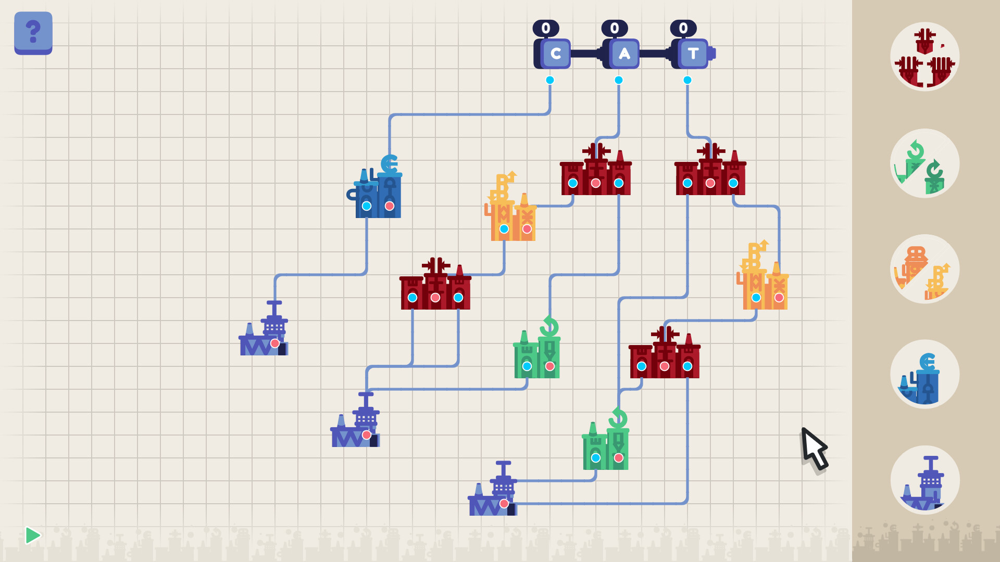

I was originally planing to make this post a list of my top five games from the past year, but I felt like (1) It is hard to leave out the rest of the games I liked, (2) I have not even played so many games from 2023, and (3) what about the ones I disliked? So I'll instead list all games from 2023 that I managed to play (according to my Steam review) until the end of the year, a format I like to read in other blogs such as [Tyler Glaiel's](https://medium.com/@tglaiel). I won't rank the games but divide the list into three categories, with no particular order within them: games I loved, games I thought I would love but were sadly disappointments, and the others (that I also liked). There are a few games I played but don't want to include in this list, like *Dave the Diver*, because I didn't spend enough time on it, or *Tears of the Kingdom*, because everyone has already said so much about it.

**Games I loved:**

***Season: A Letter to the Future***

*Season* is a game where you wander around a dying world to explore and record its sounds, images, and people. Despite this premise that sounds dark, the game is super relaxing and its visuals are stunning. I really enjoyed obsessing over decorating my scrapbook pages in the game.

***Cocoon***

It is kind of hard to describe what *Cacoon* is about, both because the game does not explain anything in it —there is no HUD and no in-game dialogue or signs— and because of its worlds-within-worlds puzzles. Still, the game manages to teach how it's played without explicitly telling anything. This is mainly a puzzle game, although it has a few short boss fights in between puzzles. Each puzzle manages to be unique in some way and I never felt frustrated as they got more and more complex. Both puzzle and world design in *Cacoon* is amazing, I was constantly impressed by how so many puzzles from different areas in the game are interconnected. Its wordlessness fits well with the game's mysterious alien world(s), where you have no idea what any of the things you see in the game are and everything is very much open to interpretation.

***Cobalt Core***

A rogue-lite deck-building game with super cute characters would normally be convincing enough for me, but *Cobalt Core* is at the same time a successor to one of my favorite games, *FTL*. Its mechanics are more creative than any deckbuilder I played since *Slay the Spire*, and the positioning of the ship and its parts as an additional mechanic is quite fun. I loved everything in the game, from its music to its dialogue lines (it is especially fun when the characters comment on the choice of a card you play). There is sadly not a huge variety of cards and items in the game, so I hope it gets more content soon and I can continue to play it.

***Chants of Sennaar***

This one is a linguistic puzzle game where you need to translate different symbols to solve an overarching mystery. I know it sounds kind of like *Heaven's Vault*, but *Chants of Sennaar* has less side-action, the whole game is about decoding multiple unique languages, and everyone in the game except your character seems to speak at least one of these languages. As I began the game I also expected it to be less hand-holdy and more mysterious, like *Cocoon*, but (to my disappointment) the game asks you to guess and verify each symbol, by matching them with an image or equivalent symbol in one of the other languages, which then reveals the English translation of the symbol. I think it would be much more rewarding if I could just interpret the words as I wanted and then see if they make sense in the different contexts I encounter later, instead of trying to match them with a definition right away (unavoidably, at times, by trying different combinations until I get it right). This would also make it more interesting to talk about the game with other players, as you could compare the different translations. I still enjoyed *Chants of Sennaar*, and liked how the designers put extra effort into making each language have unique grammatical and syntactic features.

***Against the Storm***

*Against the Storm* has been my holiday season game, I've only started playing recently but already spent a lot of hours in it. It blends rogue-lite with city builder, which also makes it much more fast-based than a typical city builder. In each run (which takes somewhere between one to three hours) you create a settlement from scratch with random modifiers and a set of buildings, trying to achieve a set of goals. These goals are randomized but they can still be achieved in multiple ways, by focusing on different things like the economy, population, exploration etc. Since it is a rogue-lite, there is also overall progress and each successful settlement unlocks more content. For me, no run so far felt the same and I will probably continue to play this game for a long time.

**Games I expected more from:**

***The Talos Principle II***

It would not be an exaggeration to say that I find every aspect of *The Talos Principle* sequel a step down from the first game. My main issue with the games are the puzzles, which are repetitive and they **never** become more difficult. I was especially disappointed by the "star puzzles" that I found mind-blowing in the first game. In Talos II, these extra puzzles are tedious tasks like walking between two beams that are not at all hidden. Design elements I found interesting in the first game, like the option to leave messages for other players and puzzles where you need to bring in an item from another puzzle are replaced with an enormous game world with supposedly hidden locations to discover, which are all marked in an in-game compass (as they would otherwise be too frustrating to find because of the vastness of the game world). The writing, on the other hand, lacks subtlety to an annoying degree.

***Oxenfree II***

Another case of sequelitis. I was excited to play it when I heard about *Oxenfree II*, although I am not sure if I ever felt like *Oxenfree* needed a sequel. Sadly the result was a game with flabby writing. I don't even remember enough of the story to get into details.

**The rest (which I liked):**

***Handshakes***

This a cooperative Sokoban game where two players extend their virtual arms and push objects in the way to eventually grasp each other's hands. *Handshakes* takes only around an hour, but I had a great time playing it. I will continue to recommend this game to everyone I know as a game guaranteed to get a laugh. I should probably also mention that it is [free](https://store.steampowered.com/app/2171690/Handshakes/). I am looking forward to the follow-up to it.

***Dune***

*Dune* was probably the only RTS/4X game I played in 2023. It is a pretty solid game in its genre, and I love that a session is completed in two to three hours.

***Dredge***

*Dredge* was enjoyable enough, but I have no clue why it became as popular as it did as soon as it was released. 

***Luck be a Landlord***

A slot machine roguelike deck-builder (without cards) about trying to collect enough money to pay an ever-increasing rent. While *Luck be a Landlord* is not a very complex game, it has incredibly fun synergies. I might have played it a bit too much.

***The Bookwalker: Thief of Tales***

*The Bookwalker* was a pleasant surprise. I didn't know anything about it except that its artwork looked intriguing (and kind of Disco Elysium-ish) before starting to play. I'd recommend it to anyone who likes classical point-and-click adventures and metafiction.

***Outlanders***

This is another city building survival game that has a set of goals in each level, like *Against the Storm*. In contrast to all the gloominess of *ATS*, *Outlanders* is as cozy as it gets, with its colorful low poly visuals, relaxing music, and lack of any kind of combat.

***Word Factori***

Another unusual example of its genre on this list has to be *Word Factori*, a minimalist factory/automation game where you construct letters out of the only material you have in the game: `the letter i `. I mainly liked the puzzle aspect of it, i.e. finding out the different ways to create each letter out of the letter i, but in general, I am not a huge fan of automation games so I haven't spent much time trying to make my construction chain efficient, which is a big part of the game.

***King of the Castle***

An interesting medieval party game where one player plays as the monarch, and others as the nobles who want to scheme against the monarch. It is also a narrative-heavy party game with many possible branches and somewhat visual novel-like dialogue screens where each player can read out their lines after selecting what to say.

