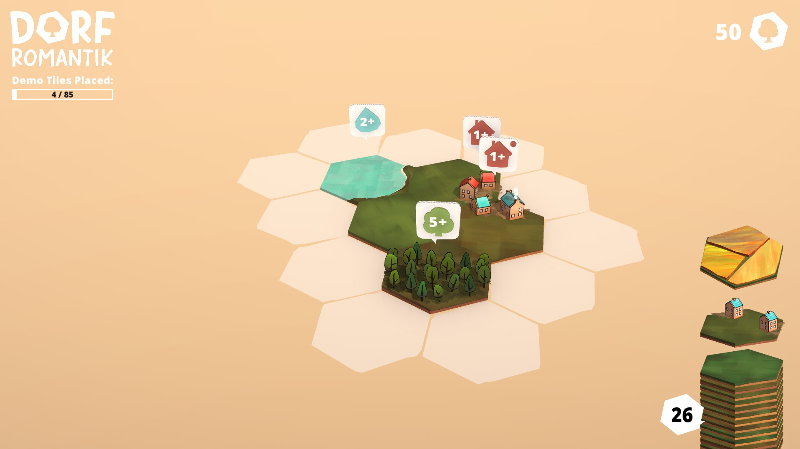
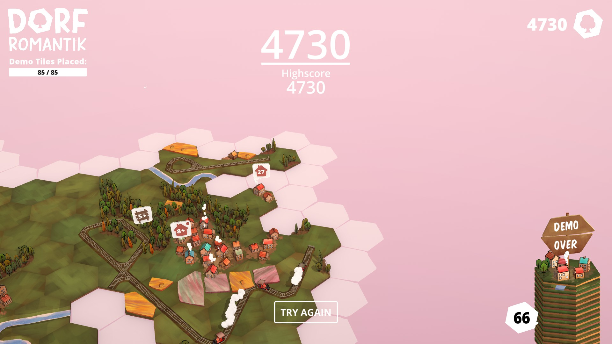

Minimalist strategy and high score games —I need more of them. I’m talking about games like *Mini Metro* (see my older post about it [here](https://mostlyindie.com/minimetro)): simple mechanics, minimalist design, relaxing music. 

I still go back to *Mini Metro* every once in a while, and when [*ISLANDERS*](https://store.steampowered.com/app/1046030/ISLANDERS/) came out in 2019, I  played it non-stop for months. *ISLANDERS* is a lot like *Mini Metro*, but the city-building high score gameplay makes the game a little bit harder to go back to after taking a break from it because you need to remember how many points the buildings get and which buildings work together. I guess you can’t make a city-building game as minimalist as *Mini Metro*, in which you literally draw lines to connect a bunch of shapes to each other, but still, building a beautiful landscape by just placing pieces together is also super relaxing and addictive.

The upcoming game [*Dorfromantik*](https://store.steampowered.com/app/1455840/Dorfromantik/) might be the closest game to *ISLANDERS*—and I’ve been looking for more games like it forever. I tried [*Townscaper*](https://store.steampowered.com/app/1291340/Townscaper/) when it first came out, and it looks very pretty, but without any kind of scoring system or strategy aspect, I think it’s just not the same. In *Dorfromantik*, you have procedurally generated tiles of land to place together, instead of individual buildings to place on different parts of terrain. If you’re familiar with the board game *Carcassonne*, the tiles work just like the tiles in it, except that the ones in *Dorfromantik* are hexagons.

The scoring system in *Dorfromantik* is super simple but brilliant (it took me a while to fully understand it when I played the demo, so if there’s anything I still get wrong, just let me know!): You get 10 points for every edge of a tile you place that matches any adjacent tile. Some tiles also come with quests, which give you additional points and add more tiles to your stack when they are completed, so you can keep playing as long as you keep completing quests. This scoring system makes the game perfectly minimalist and super easy to get into. And unlike *ISLANDERS*, you don’t really need to be playing *Dorfromantik* for a long time to beat your high score.

I’m already obsessed with the [demo version](https://store.steampowered.com/app/1455840/Dorfromantik/). Right now it sadly allows you to only play until you place 85 tiles, but it's also getting an early-access release on Steam on March 25, and I can’t wait to play more of it!

  
