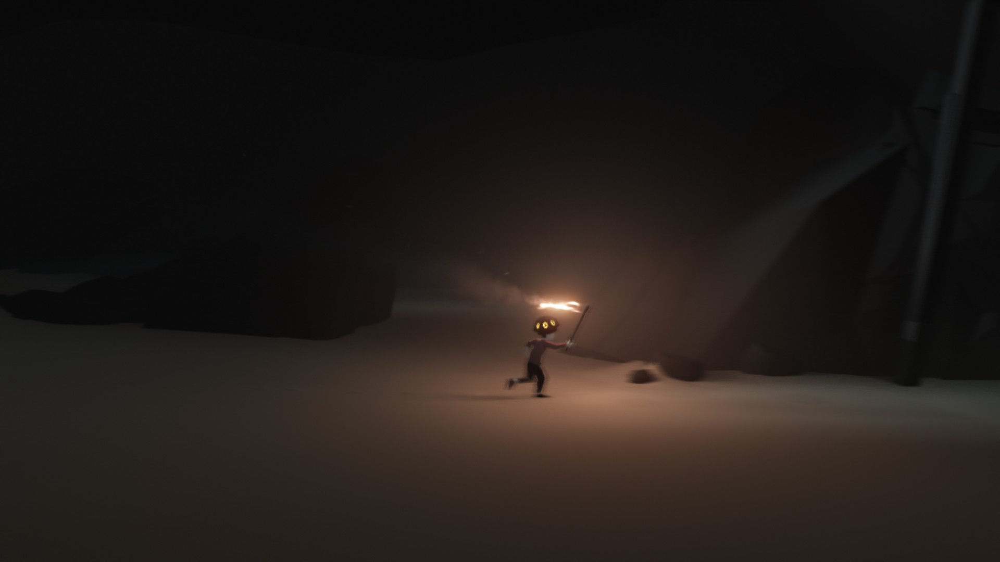

I got *[INSIDE](https://playdead.com/games/inside/)* during the Steam holiday sale. It is very much like *[LIMBO](https://playdead.com/games/limbo/)* and that’s great, because what else could you ask for?

The atmosphere and animatons are incredible! Swimming in this game feels so good –until it gets creepy. One thing I didn’t like is the story, which is almost non-existent. It freaks you out and keeps the hype up until the end… And then turns out to be nothing more than what you can make up out of the random clues you got in the process. That might also be cool, if you’re into open endings and all those theories and eastereggs, but for me the ending was just not good enough to make me care about its meaning.
