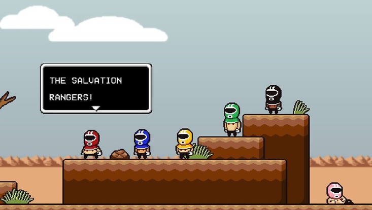

The blog has been very inactive lately, so here is a game with annoying unpopularity: *[LISA](http://www.lisatherpg.com/index.html)*

It’s an rpg that is similar to *Undertale*, or *Earthbound*... or maybe *Fallout* or *Y: The Last Man* with its post-apocalyptic wasteland, where all women died out (except Lisa, duh). And the story is mostly about drugs, alcoholics, bullies, child abuse and such… I know these might not make it sound like the most fun rpg, but believe me, *LISA* manages to make you laugh hard in addition to driving you into depression! So if you're into post-apocalypse fiction and/or dark humour, you can give it a try by playing the short -and free- prequel *[Lisa the First](https://rpgmaker.net/games/4412/)*. Keep in mind that the story is incomplete without that prequel and the DLC, *LISA the Joyful*. I enjoyed the overall story and the ending in the DLC, but the base game has much more content than the DLC and the prequel.

What I liked most about *LISA* was definitely that your decisions really change something, but then they have to suck either way, like when you have to decide whether to lose an arm or watch your company die, or when it is highly possible to lose all your side-characters in Russian Roulette.

Last but not least: [Awesome soundtrack](https://widdly2diddly.bandcamp.com/releases) composed by [the one guy](https://www.kickstarter.com/profile/131274701) behind this game!
