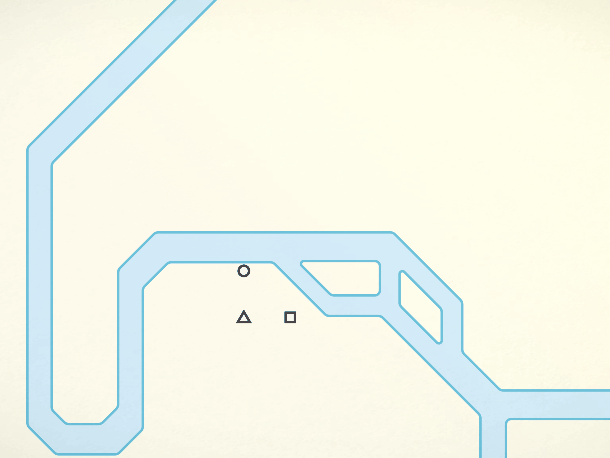

[*Mini Metro*](https://dinopoloclub.com/games/mini-metro/) is addictive. It might look super simple and zen-like at first glance, but does become quite difficult and stressful once you get into it and try to score higher and higher. As an endless high score game, this wouldn’t normally be my cup of tea, but *Mini Metro* manages to keep me (somewhere) on its high score lists almost every day, as it offers some different modes like daily and all-time leaderboards for different cities with their own struggles and it doesn't look like I'll get bored of it anytime soon. <3

Also, I’m SHOCKED to see negative criticism on its soundtrack! One reason I wanted to play this game was its music by Disasterpeace. He is easily one of my favorite composers and I love every bit of his chiptune that you can hear in many other awesome games such as, *FEZ*, *The Floor is Jelly* and *Hyper Light Drifter* and the horror movie, *It Follows*.
[Check out his music](http://disasterpeace.com/music), if you haven’t already done so. You can listen to all of his music on [Spotify](https://open.spotify.com/artist/7rSMEcqv4Ez0OLgJKDjrvq), as well. 
